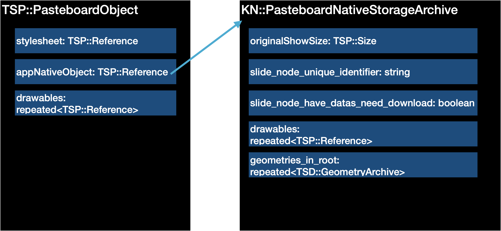
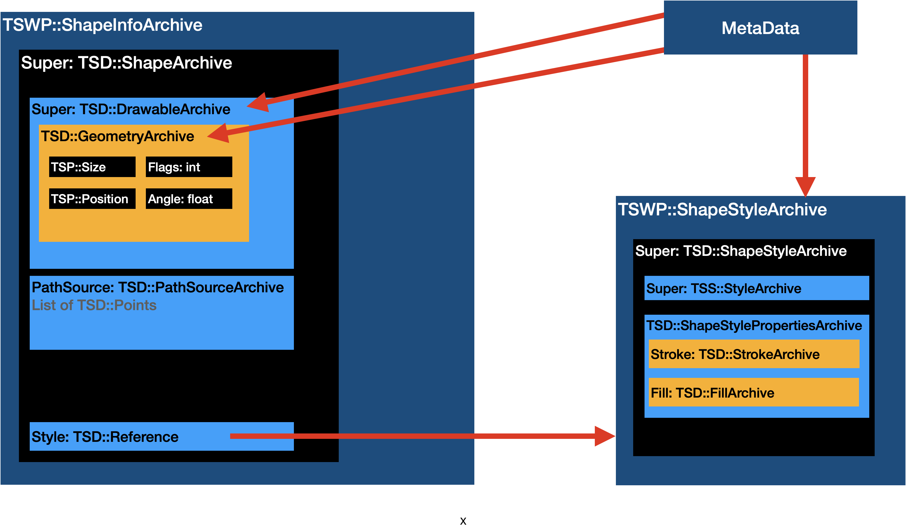
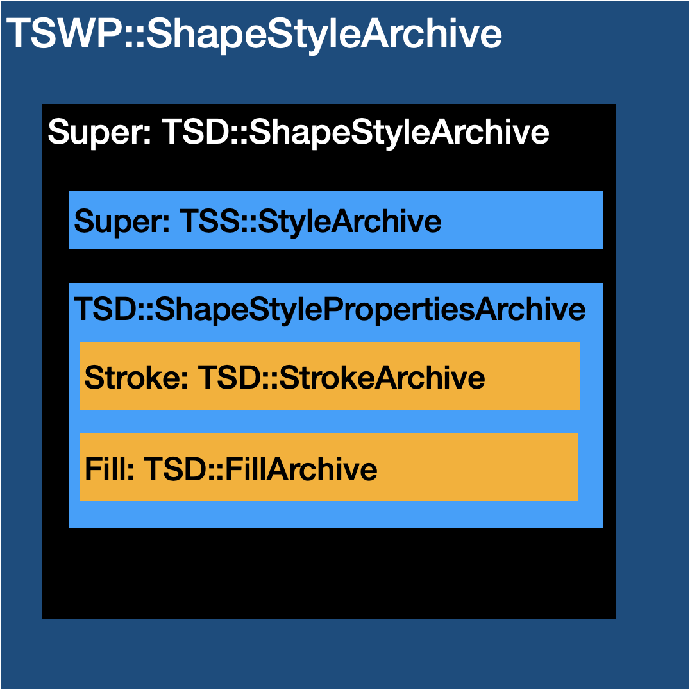

# Keynote Format Documentation

## Introduction

- The general format of a Keynote 2013/2014 document was discovered by [obriensp](https://github.com/obriensp) and his original documentation of format can be found here:
    - [https://github.com/obriensp/iWorkFileFormat/blob/master/Docs/index.md](https://github.com/obriensp/iWorkFileFormat/blob/master/Docs/index.md)

## How are Keynote 2013/2014 files structured

Keynote 2013 and Keynote 2014 files use the same data structures internally, but have minor structural differences. 

### Keynote 2013
These files are stored in the form of a package, which contains many files including images, but of most interest is the `Index.zip` file. This contains all of our `.iwa` files which will be covered in more detail shortly.

### Keynote 2014
Keynote 2014 files are no longer packages, but rather just a `zip` archive. Once we extract the contents of the archive the contents is identical to `Keynote 2013`, but rather than containing `Index.zip` with all of the `.iwa` files, there is a directory `Index` containing these files.

## The `.iwa` files
`.iwa` files are `iWork Archive` files and they contain all the data to represent objects in a presentation. Each "component", has its own `iWork Archive`, and components can be of the following types:

- `AnnotationAuthorStorage`
- `CalculationEngine`
- `Document`
- `DocumentStylesheet`
- `Slide`
- etc.

We are mostly interested in the contents of the `Slide iWorkArchives`, as these contain information about what objects exist on a given slide.

Also of interest is the `DocumentStylesheet`, as this contains information about the styling for the above mentioned objects.


Each of these `iWork Archives` stores data in the form of a [Snappy](https://github.com/google/snappy) compressed [Protobuf](https://github.com/protocolbuffers/protobuf) stream.

Once we uncompress the [Snappy](https://github.com/google/snappy) stream we can use the [Protobuf](https://github.com/protocolbuffers/protobuf) library to convert the [Protobuf](https://github.com/protocolbuffers/protobuf) messages into objects native to the respective programming language.

More details can be found in the original [documentation](https://github.com/obriensp/iWorkFileFormat/blob/master/Docs/index.md) made by [obriensp](https://github.com/obriensp).


## How is a Keynote clipboard formatted?

A Keynote clipboard is formatted very similarly to a Keynote file. Rather than having multiple `iWork Archive` files with lists of snappy compressed protocol buffer streams it adds these lists directly to the macOS pasteboard. There is also no snappy compression in the clipboard, so the contents of the clipboard is just a raw protobuf stream. 
In total 2 such lists are necessary; one for metadata and one for everything else. 

In the macOS pasteboard we require the following three custom types:

- com.apple.iWork.TSPNativeData
- com.apple.iWork.TSPNativeMetadata
- com.apple.iWork.pasteboardState.hasNativeDrawables

**com.apple.iWork.TSPNativeData:**

- Contains all of the necessary data for objects to be pasted. Contains both the contents which would have been found in the `Slide iWork Archive` and the `DocumentStylesheet iWork Archive`
- Comprised of a list of protocol buffer messages, which are not snappy compressed.

**com.apple.iWork.TSPNativeMetadata:**

- Only requires a single object of type **TSP::PasteboardMetadata**
    - This object contains version information about the used Keynote version
        - Example of creation in C++

    ```cpp
    auto* pasteboardMetadata = new TSP::PasteboardMetadata();
    pasteboardMetadata->add_version(11);
    pasteboardMetadata->add_version(1);
    pasteboardMetadata->add_version(2);
    pasteboardMetadata->set_allocated_app_name(new std::string("com.apple.Keynote 11.1"));
    pasteboardMetadata->add_read_version(2);
    pasteboardMetadata->add_read_version(0);
    pasteboardMetadata->add_read_version(0);
    ```

**com.apple.iWork.pasteboardState.hasNativeDrawables**
- This type requires no content, but must just be present on the pasteboard.

### Note: The Following now only refers to the content of "com.apple.iWork.TSPNativeData"

## What is required to create a functional Keynote clipboard?

In order to have a functional Keynote clipboard we need the following 2 objects with the following properties filled as seen in the diagram:



**`TSP::PasteboardObject`**
- Requires a reference to a stylesheet
- Requires a reference to the `KN::PasteboardNativeStorageArchive`
- Requires a reference to any drawables (e.g. shapes). These references in the case of shapes point to a `TSWP::ShapeInfoArchive` object.

**`KN::PasteboardNativeStorageArchive`**
- Requires the dimesions of the original presentation it was copied from
- Requires a unique identifier in the form of a `GUID` stored as a string.
- Requires a boolean which indicates if there is data which needs to be downloaded. For general shapes this is always set to false.
- Requires a reference to any drawables (e.g. shapes). These references in the case of shapes point to a `TSWP::ShapeInfoArchive` object.
- Requires a list of all `TSD::GeometryArchive`. This contains the same values as the `TSD::GeometryArchive` stored inside of the `TSWP::ShapeInfoArchive`, the structure of which is shown below.


## Shapes

- Each shape is represented `TSWP::ShapeInfoArchive` which needs the following other objects as properties and subproperties:
    - `tswp.shapeInfoArchive→super` :: `TSD::ShapeArchive`
        - `tswp.shapeInfoArchive→super→super` :: `TSD::DrawableArchive`
            - `ShapeInfoArchive→super→super→geometry` :: `TSD::GeometryArchive`
        - `tswp.shapeInfoArchive→super→pathsource` :: `TSD::PathSourceArchive`

- Although it is not necessary for a shape to have styles, styles are stored in a `TSWP::ShapeStyleArchive` and are referenced from the `TSD::ShapeArchive` as seen in the diagram below.

- Requirements for shape to function:
    - Geometry→position→(x,y)
    - Geometry→size→(width, height)
    - Some sort of `TSD::PathsourceArchive` archive. This defines the points of the paths or the bézier curves

- Note: Shapes scale up to the size of their view box in Keynote.

Below is an example of what is required for a shape with stying:



### `TSD::GeometryArchive`
For the `TSD::GeometryArchive` it's size and position attributes are necessary. The flags attribute is necessary to the extent, that if left out Keynote recognizes the shape as a text box. In this case the options for scaling aren't the same as if it were stores as a "shape". In keynote the flags value is set to `3` for shapes. It seems other values have the same effect, but setting the value to `3` when generating your own shapes functions correctly.

### `TSD::PathSourceArchive`
The `TSD::PathSourceArchive` must contain a value of one of these 6 types:
- `scalar_path_source: TSD::ScalarPathSourceArchive`
- `callout_path_source: TSD::CalloutPathSourceArchive`
- `connection_line_path_source: TSD::ConnectionLinePathSourceArchive`
- `point_path_source: TSD::PointPathSourceArchive`
- `bezier_path_source: TSD::BezierPathSourceArchive`
- `editable_bezier_path_source: TSD::EditableBezierPathSourceArchive`

Of these 6 types of PathSourceArchives the `bezier_path_source` is the most interesting, and many of the other types have very niche use cases for Apple's custom shapes.

### `TSD::BezierPathSourceArchive`
To create a object of type `TSD::BezierPathSourceArchive` the attribute `naturalSize`, which contains the dimensions of the path and the attribute `path`, which defines the bézier points are required.
A `TSP::Path` then requires a list of typed elements. In the below protobuf definition, the types of elements are made clear:
```
message Path {
  message Element {
    required .TSP.Path.ElementType type = 1;
    repeated .TSP.Point points = 2;
  }
  enum ElementType {
    moveTo = 1;
    lineTo = 2;
    quadCurveTo = 3;
    curveTo = 4;
    closeSubpath = 5;
  }
  repeated .TSP.Path.Element elements = 1;
}
```

As you can see above a single element of a path can contain multiple points (repeated field). This is used for example if the `ElementType` is `curveTo`, and thus we need 3 points to define the bézier curve. In the case of a bèzier curve the first set of points correspond to the in points, the second to the control points and the final set of points refer to the out points.

Below is a short code example of creating a bézier element.

```cpp
void addBezierPathElement(TSP::Path* path, float x_in, float y_in, float x_control, float y_control, float x_out, float y_out) {
    TSP::Path_Element* element =  path->add_elements();
    element->set_type(TSP::Path_ElementType_curveTo);

    setPoint(element->add_points(), x_in, y_in);
    setPoint(element->add_points(), x_control, y_control);
    setPoint(element->add_points(), x_out, y_out);
}

```

## Shape Styles


### `TSWP::ShapeStyleArchive`
In the case of generating the styles for a shape only the `super: TSD::ShapeStyleArchive` is really relevant. There also exists the attribute `shape_properties: TSWP::ShapeStylePropertiesArchive` which contains information about alignment, padding etc.

### `TSD::ShapeStyleArchive`
Here is where most of the relevant information is stored. The `TSS::StyleArchive` only contains an identifier. The default is `shape-0-shapestyle` and can always just be set to this value. It also contains the additional attribute of `override_count: uint32`. This is used to define, which style should be prioritised if multiple are available for a shape. This value can be set to any large number, and then this style should be the one applied to the respective shape.

### `TSD::ShapeStylePropertiesArchive`

This object contains the `stroke` and `fill` attribute as seen on the diagram. One can also set the `opacity` as a `float` between `0` and `1`. This then defines the shape opacity. Fill or stroke specific opacity can be later defined in their respective archives.

### TSD::StrokeArchive
The protobuf definition for the `TSD::StrokeArchive` message looks as follows:
```
message StrokeArchive {
  enum LineCap {
    ButtCap = 0;
    RoundCap = 1;
    SquareCap = 2;
  }
  optional .TSP.Color color = 1;
  optional float width = 2;
  optional .TSD.StrokeArchive.LineCap cap = 3;
  optional .TSD.LineJoin join = 4;
  optional float miter_limit = 5;
  optional .TSD.StrokePatternArchive pattern = 6;
  optional .TSD.SmartStrokeArchive smart_stroke = 7;
  optional .TSD.FrameArchive frame = 8;
  optional .TSD.PatternedStrokeArchive patterned_stroke = 9;
}
```

For a stroke only the `color` and `width` are necessary. We can also change the join and cap type for the lines by setting the appropriate values. This is functionality which is not accessible to add inside of Keynote, but if added into a message manually is fully supported.

### TSD::FillArchive
The protobuf definition for the `TSD::FillArchive` message looks as follows:

```
message FillArchive {
  optional .TSP.Color color = 1;
  optional .TSD.GradientArchive gradient = 2;
  optional .TSD.ImageFillArchive image = 3;
}
```

Here it suffices to add the fill color, which with `srgb` can contain opacity. Gradients are built up very similar to in svg, where you have multiple gradient steps to define a gradient. 

### TSP::Color
The protobuf definition for the `TSP::Color` message looks as follows:


```
message Color {
  enum ColorModel {
    rgb = 1;
    cmyk = 2;
    white = 3;
  }
  enum RGBColorSpace {
    srgb = 1;
    p3 = 2;
  }
  required .TSP.Color.ColorModel model = 1;
  optional float r = 3;
  optional float g = 4;
  optional float b = 5;
  optional .TSP.Color.RGBColorSpace rgbspace = 12;
  optional float a = 6 [default = 1];
  optional float c = 7;
  optional float m = 8;
  optional float y = 9;
  optional float k = 10;
  optional float w = 11;
}
```

Here one can set `model` to `rgb`, `rgbspace` to `srbg` and the it suffices to add values for `r`, `g` `b` and `a`.